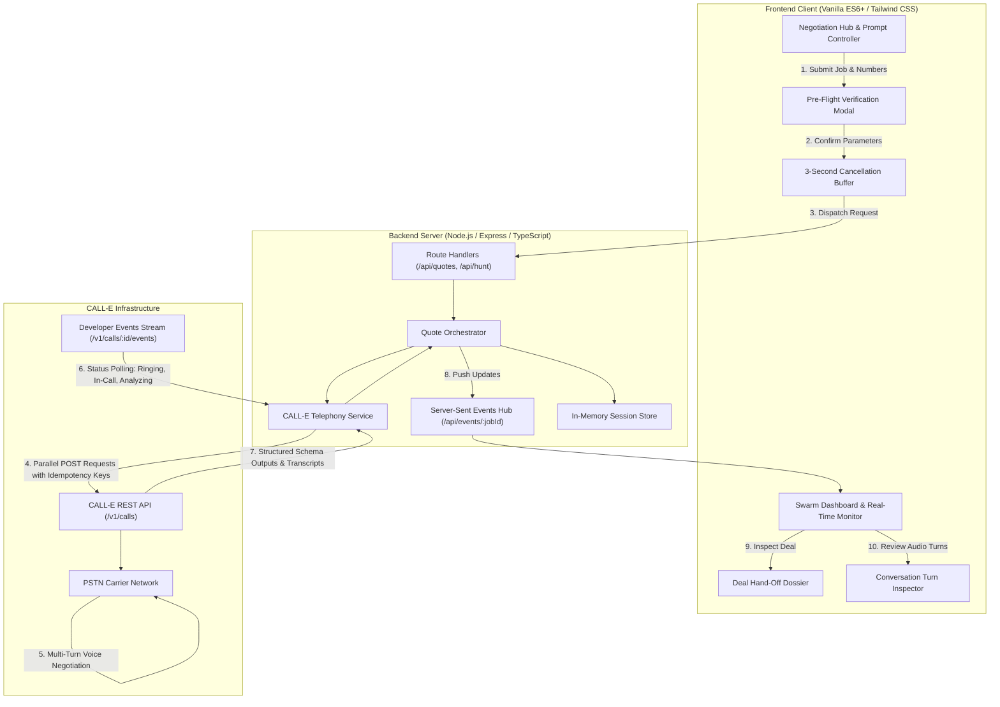

# QuoteHunter: Autonomous Voice Agent Swarm for Vendor Quote Negotiation

QuoteHunter is an autonomous voice agent platform that dispatches parallel outbound phone calls to local service providers via CALL-E. It negotiates pricing in real time, extracts structured financial and availability data grounded in verbatim spoken evidence, and compiles an executive hand-off dossier for final human closing.

Built for the CALL-E: Your Code Is Calling Hackathon.

**Live Production URL:** [https://call-e-your-code-is-calling.onrender.com](https://call-e-your-code-is-calling.onrender.com)

---

## Executive Summary

When hiring trade professionals such as painters, plumbers, electricians, or general contractors, pricing is not exposed via public APIs. Consumers and small businesses spend hours manually contacting multiple vendors, repeating project requirements, leaving voicemails, and recording scattered notes.

QuoteHunter automates this procurement workflow. By leveraging the CALL-E telephony and voice AI infrastructure, QuoteHunter executes multi-turn voice negotiations across multiple service providers concurrently. In less than three minutes, users receive structured, side-by-side bids with itemized costs, confirmed availability, and recorded conversational evidence.

---

## Key Capabilities

### Concurrent Swarm Telephony
- Executes outbound calls to multiple vendors simultaneously using isolated worker promises (`Promise.allSettled`).
- Assigns unique idempotency keys (`qh_<jobId>_<vendorId>`) to every outbound call request, preventing duplicate telecommunication dispatches during network retries.
- Accepts E.164 formatted international telephone numbers or automatically extracts numbers directly from free-form user prompts.

### Safety Pre-Flight Verification and Buffer
- Operator review modal confirms the target category, vendor numbers, and exact instructions before initiating network calls.
- A three-second animated circular SVG countdown timer provides an immediate, one-click cancellation window before telecommunication carriers are engaged.

### Real-Time Lifecycle Streaming
- Streams call progression directly to the client interface using Server-Sent Events (SSE).
- Tracks granular carrier milestones: Provisioning, Carrier Routing, Phone Ringing, Active Conversation, Transcript Analysis, and Quote Finalization.
- Displays dynamic elapsed-time counters and per-vendor progress indicators in real time.

### Structured Schema Extraction and Arithmetic Reconciliation
- Enforces strict JSON Schema validation on CALL-E call outputs.
- Extracts key contractual parameters: numeric price, availability timeline, warranty coverage, and material conditions.
- Anchors every data point to verbatim spoken quotes from the vendor, eliminating AI hallucination.
- Employs an arithmetic reconciliation engine (`reconcileItemizedQuote`) that cross-checks itemized subcomponents (labor vs. materials vs. discounts) against spoken evidence to correct LLM calculation errors.

### Human-in-the-Loop Deal Dossier
- Telephone numbers remain masked during negotiation to safeguard privacy.
- Unmasks verified numbers upon operator selection and generates an executive closing sheet.
- Provides one-click native actions: direct cellular dial (`tel:`), pre-filled WhatsApp confirmation messages, and clipboard export.

### Turn-by-Turn Conversation Inspector & Neural Speech Player
- Visual speech timeline display with role-specific speaker badges (Agent vs. Vendor), conversational latencies, and duration metrics.
- Dual-Speaker Edge-TTS Neural Audio Engine: Streams lifelike Microsoft Azure Neural speech (`en-US-JennyNeural` for AI Agent, `en-US-GuyNeural` for Vendor/Contractor) with in-memory LRU caching, variable speed control (1X, 1.25X, 1.5X, 2X), seeking scrubber, and turn jumping. Requires zero external API keys.
- User-friendly error handling: In the event of network disruption or stream failure, informative toast alerts notify the operator without crashing or falling back to robotic browser synthesis.
- Employs a fail-closed architecture: failed, unanswered, or declined calls are explicitly classified with transparent failure notices rather than fabricated transcripts.

---

## System Architecture



---

## Technical Specifications

### Telephony and API Protocol
- Endpoint: `https://api.heycall-e.com/v1/calls`
- Authentication: HTTP Bearer Token using CALL-E Developer Key (`iams_...`).
- Concurrency: Managed via Node.js asynchronous runtime and non-blocking I/O.
- Status Polling: Incremental polling of CALL-E developer events (`/v1/calls/:id/events`) with exponential backoff and timeout thresholds.

### Structured Output Schema
Calls are dispatched with a strict JSON schema that structures vendor commitments:

```json
{
  "type": "object",
  "required": ["quote_provided", "price_estimate", "price_numeric", "availability", "evidence"],
  "properties": {
    "quote_provided": {
      "type": "string",
      "enum": ["yes", "no", "unknown"],
      "description": "Whether the provider offered an estimated or fixed price quote."
    },
    "price_estimate": {
      "type": "string",
      "description": "The formatted total price including work, labor, and materials."
    },
    "price_numeric": {
      "type": "number",
      "description": "The exact numerical sum of all quoted items."
    },
    "availability": {
      "type": "string",
      "description": "Stated availability or start date."
    },
    "additional_conditions": {
      "type": "string",
      "description": "Applicable terms, warranties, travel fees, or materials coverage."
    },
    "provider_notes": {
      "type": "string",
      "description": "Summary notes on conversation context."
    },
    "evidence": {
      "type": "string",
      "description": "Verbatim spoken statements from the vendor supporting the data."
    }
  },
  "additionalProperties": false
}
```

---

## Telephony Safety and Ethical Standards

| Policy | Architectural Implementation |
| :--- | :--- |
| Mandatory AI Disclosure | The agent discloses its AI identity immediately in its opening line: *"Hi! I'm calling about a [category] job for a client in your area. I'm an automated assistant gathering quick estimates — do you have a quick minute for a ballpark quote?"* |
| Non-Binding Authority | The agent states explicitly that it is gathering estimates for human review and cannot authorize contracts or process payments. |
| Operator Intent Confirmation | Pre-flight review dialog requires deliberate operator confirmation before network requests are queued. |
| In-Flight Buffer Window | A three-second countdown buffer allows the user to cancel before carrier signaling is established. |
| Idempotency Protection | Calls utilize unique idempotency tokens (`qh_<jobId>_<vendorId>`) to prevent duplicate telecom charges during network reconnections. |
| Number Format Enforcement | Strict regular expression validation (`^\+[1-9]\d{7,14}$`) validates numbers against ITU-T E.164 standards before dispatch. |
| Non-Existent Demo Series | Default presets use the officially reserved North American Numbering Plan `555-01XX` fictional series to prevent unintended connections during testing. |
| Fail-Closed Integrity | Unanswered calls, busy signals, and carrier disconnects fail cleanly with explicit error badges, preventing synthetic quote generation. |

---

## API Reference

### Health and System Status
```http
GET /api/status
```
Returns system uptime and CALL-E configuration status.

Response:
```json
{
  "status": "online",
  "app": "QuoteHunter",
  "version": "1.0.0",
  "calleConfigured": true,
  "calleApiKeyPresent": true
}
```

### Retrieve All Jobs
```http
GET /api/quotes
```
Returns all active and archived negotiation threads.

### Retrieve Job by Identifier
```http
GET /api/quotes/:id
```
Returns full metadata, vendor statuses, and structured results for a specific job.

### Cancel In-Flight Job
```http
POST /api/quotes/:id/cancel
```
Terminates active polling routines and dispatches carrier cancellation signals for all active calls associated with the job.

### Launch Quote Negotiation Hunt
```http
POST /api/quotes
Content-Type: application/json
```

Request Body:
```json
{
  "category": "painting",
  "description": "Call and inquire if available to paint a 3BHK apartment including walls and ceilings.",
  "vendors": [
    { "name": "Apex Painting Co.", "phone": "+15550100100" },
    { "name": "Metro Painters", "phone": "+15550100101" }
  ],
  "mode": "live"
}
```

Execution Modes:
- `"mode": "live"`: Dispatches live outbound telephony calls through CALL-E REST API and connects to actual cellular/PSTN carriers.
- `"mode": "simulate"`: Runs a realistic local dry-run with staggered phone call lifecycles, ringing states, and sample quotes without consuming CALL-E telephony credits.

### Real-Time Event Stream
```http
GET /api/events/:jobId
Accept: text/event-stream
```
Establishes a persistent Server-Sent Events connection streaming vendor state transitions and job completion events. Includes 15-second `:keepalive` heartbeat comments to prevent proxy or browser timeouts during long multi-minute negotiations.

---

## Technology Stack

- Runtime Environment: Node.js (v18+) with ECMAScript Modules (ESM).
- Server Framework: Express 4 with CORS and express.json middleware.
- Programming Language: TypeScript 5 with strict mode enforcement.
- Real-Time Communication: Server-Sent Events (SSE) via native HTTP streams.
- Telephony Platform: CALL-E Voice AI Developer API (`api.heycall-e.com`).
- Speech Engine: Microsoft Edge Neural TTS (`msedge-tts`) streaming Azure Neural Voices (`en-US-JennyNeural` & `en-US-GuyNeural`) with server LRU caching (100% free, zero API key required).
- Client Architecture: Single Page Application (SPA) in Vanilla JavaScript (ES6+).
- Styling Framework: Tailwind CSS utility architecture.
- Typography and Assets: Plus Jakarta Sans and Google Material Symbols.
- Local Storage: Browser LocalStorage for client-side thread history.

---

## Local Development and Setup

### Prerequisites
- Node.js version 18.0.0 or higher
- npm version 9.0.0 or higher
- A valid CALL-E Developer API Key (`iams_...`)

### Installation Procedure

1. Clone the repository:
```bash
git clone https://github.com/GitSuman0699/CALL-E-Your-Code-Is-Calling.git
cd "CALL-E-Your-Code-Is-Calling"
```

2. Install dependencies:
```bash
npm install
```

3. Configure environment variables:
Create a `.env` file in the root directory:
```env
# CALL-E API Configuration
CALLE_API_KEY=iams_live_your_api_key_here

# Server Configuration
PORT=3000
```

4. Verify compilation:
```bash
npx tsc --noEmit --noUnusedLocals --noUnusedParameters
```

5. Launch development server:
```bash
npm run dev
```

6. Open `http://localhost:3000` in a web browser.

---

## Production Deployment

QuoteHunter relies on persistent HTTP connections for Server-Sent Events (SSE). It must be deployed on an environment that supports persistent Node.js processes rather than short-lived serverless functions.

### Deploying to Render

Render free-tier instances enter standby mode after 15 minutes of inactivity. QuoteHunter includes an automated cold-start wakeup orchestrator and sleep prevention system:

1. **Intelligent Cold-Start Splash Screen:**
   - Displays immediately upon opening the application with live diagnostics, real-time elapsed timer, and animated radar status.
   - Continuously pings `/api/status` until the Render container spins up and confirms online status.
   - Smoothly dissolves and reveals the swarm dashboard the moment all services are operational.
2. **Automatic 9-Minute Inactivity Keepalive:**
   - While any operator has QuoteHunter open in their browser, a background heartbeat pings `/api/status` every 9 minutes.
   - This automatically resets Render's 15-minute inactivity counter, guaranteeing the container never sleeps during active usage.
3. **Instant Tab Re-Wake:**
   - If an operator returns to a dormant tab, the `visibilitychange` listener immediately dispatches a wake ping to warm the instance before user action.

#### Render Deployment Steps
A pre-configured `render.yaml` blueprint is included:

1. Create a new Web Service or Blueprint on Render.
2. Connect this repository and select the `main` branch.
3. Configuration settings:
   - Build Command: `npm install && npm run build`
   - Start Command: `npm start`
   - Health Check Path: `/api/status`
4. Add the environment variable:
   - Key: `CALLE_API_KEY`
   - Value: Your CALL-E production API key (`iams_...`)
5. Deploy the service. Render will automatically verify `/api/status` before routing live traffic.

---

## Verification and Testing

Execute the following test suite to validate environment readiness:

```bash
# Type-check without emitting artifacts
npx tsc --noEmit

# Compile TypeScript production bundle
npm run build

# Run local health inspection
curl -s http://localhost:3000/api/status
```

---

## License

This project is released under the MIT License. Built for the CALL-E: Your Code Is Calling Hackathon.
