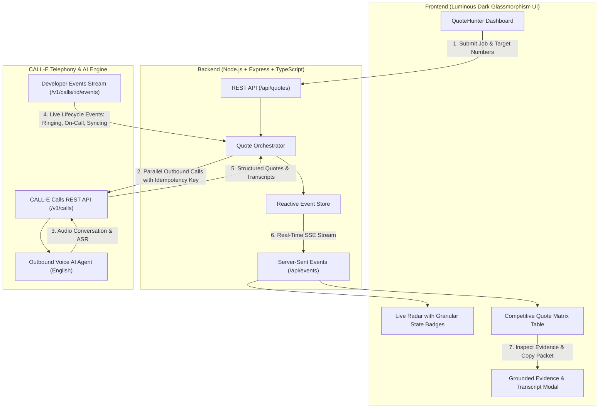

# 🏹 QuoteHunter — AI-Powered Voice Quote Aggregator

> **Autonomous AI voice agent that calls multiple service providers in parallel, negotiates real-world price quotes via CALL-E, grounds results in spoken evidence spans, and renders competitive comparison matrices in real time.**

Built for the **CALL-E: Your Code Is Calling** Hackathon.

---

## 🌟 The Problem

When hiring local service providers (painters, plumbers, electricians, caterers, contractors), **no public pricing API exists**. Homeowners and business operators spend 2–4 hours calling 5 to 10 local vendors, repeating the same job requirements, waiting through phone tag, and taking manual notes.

**Why Phone Calls Are Irreplaceable:**
- Local tradespeople and small contractors rarely have booking APIs or up-to-date pricing websites.
- Price quotes require real-time conversational negotiation (*"Does that include ceiling paint?", "Are materials separate?", "When can you start?"*).
- Phone calling is the only ubiquitous channel for local commercial discovery.

---

## 🚀 The Solution: QuoteHunter

QuoteHunter allows users to describe their job **once**. It dispatches parallel CALL-E voice agents to call every vendor simultaneously:
1. **Parallel Outbound Calling**: Dials multiple vendors in parallel via CALL-E API with automatic retry and exponential backoff.
2. **Granular Real-Time Status Stream**: Tracks live call lifecycle from *Provisioning* ➔ *Carrier Dialing* ➔ *Phone Ringing 🔔* ➔ *Live On-Call 🎙️* ➔ *Schema Extraction 📊*.
3. **Strict Structured Extraction**: Uses JSON schemas (`result_schema`) to validate price estimates, start dates, conditions, and transcript evidence snippets.
4. **Safety by Default**: Features AI identity disclosure, stable request-derived idempotency keys (`qh_<jobId>_<vendorId>`), and fail-closed outcome classifications.
5. **Human-in-the-Loop Booking**: Agents gather intelligence and compare numbers, but committing and booking requires explicit human confirmation.

---

## 🏗️ Architecture



---

## 🛡️ Safety & Production Principles

QuoteHunter strictly adheres to the core safety principles of `awesome-phone-call-agents`:

| Principle | Implementation in QuoteHunter |
|---|---|
| **Identity Disclosure** | The AI agent always clearly introduces itself on call pickup: *"Hi, I am QuoteHunter AI calling on behalf of a customer regarding a [category] job."* |
| **Idempotency Protection** | Every outbound call is dispatched with a unique `Idempotency-Key` header (`qh_<jobId>_<vendorId>`) to prevent duplicate dials on network retries or double-clicks. |
| **Fail-Closed Dispositions** | Silence, busy tones, or answering machines are never treated as consent or quotes. Calls are strictly classified as `Quoted`, `Voicemail/No-Answer`, `Declined`, or `Failed`. |
| **Transcript-Grounded Evidence** | Every price and timeline quote is anchored in a verbatim spoken transcript span with confidence scoring (`High`, `Medium`, `Low`). |
| **Human-in-the-Loop Authority** | The AI only collects estimates and compares options; final booking and financial commitment requires explicit human confirmation via the **Select & Book** action. |

---

## 🛠️ Tech Stack

- **CALL-E Integration**: Direct REST API integration (`/v1/calls`, `/v1/calls/:id/events`) with retry logic, exponential backoff, and JSON schema extraction.
- **Backend**: Node.js, Express, TypeScript, Server-Sent Events (SSE).
- **Frontend**: Dark Glassmorphism, CSS audio waveforms, JetBrains Mono data typography, Vanilla JS & CSS.
- **Modes**: 
  - **`📞 Live CALL-E`**: 100% production mode with real outbound carrier calls.
  - **`⚡ Interactive Demo`**: Client-side interactive simulation for zero-cost offline exploration.

---

## 🚦 Quickstart & Local Setup

### Prerequisites
- Node.js v18+ (tested on v24.15.0)
- npm

### Installation

```bash
# 1. Clone or navigate to the repository
cd "CALL-E Your Code Is Calling"

# 2. Install dependencies
npm install

# 3. Configure environment variables
# Copy .env.example or create .env:
# CALLE_API_KEY=iams_live_your_api_key_here
# PORT=3000

# 4. Start development server
npm run dev
```

Open **`http://localhost:3000`** in your browser.

---

## 📱 User Workflow Walkthrough

1. **Configure Job**: Select a category (*Painting, Plumbing, Electrical*) and customize the job description.
2. **Manage Vendor Queue**: 
   - Use **`Clear All`** to remove dummy presets.
   - Click **`+ Add`** to enter your mobile number (or custom contractors) in E.164 format (e.g. `+919876543210` or `+14155550100`).
3. **Launch Hunt**: Click **`🚀 Launch Parallel AI Call Hunt`**.
4. **Watch Real-Time Progression**:
   - `🤖 Initializing Agent...` ➔ `📞 Connecting Carrier...` ➔ `🔔 Ringing Phone...` ➔ `🎙️ Live On-Call` ➔ `📊 Extracting Quote...` ➔ `Quoted ✅`.
5. **Inspect & Action**:
   - Click **"Select & Book"** or **"View Details"** to open the **Grounded Evidence Modal**.
   - Review the verbatim spoken transcript span, confidence score, and call notes.
   - Click **"Copy Evidence Packet"** to export structured JSON for CRM/Sheets.
   - Click **"Export CSV"** for the complete comparison matrix.

---

## 📄 License

MIT License. Built for the community and the CALL-E ecosystem.
