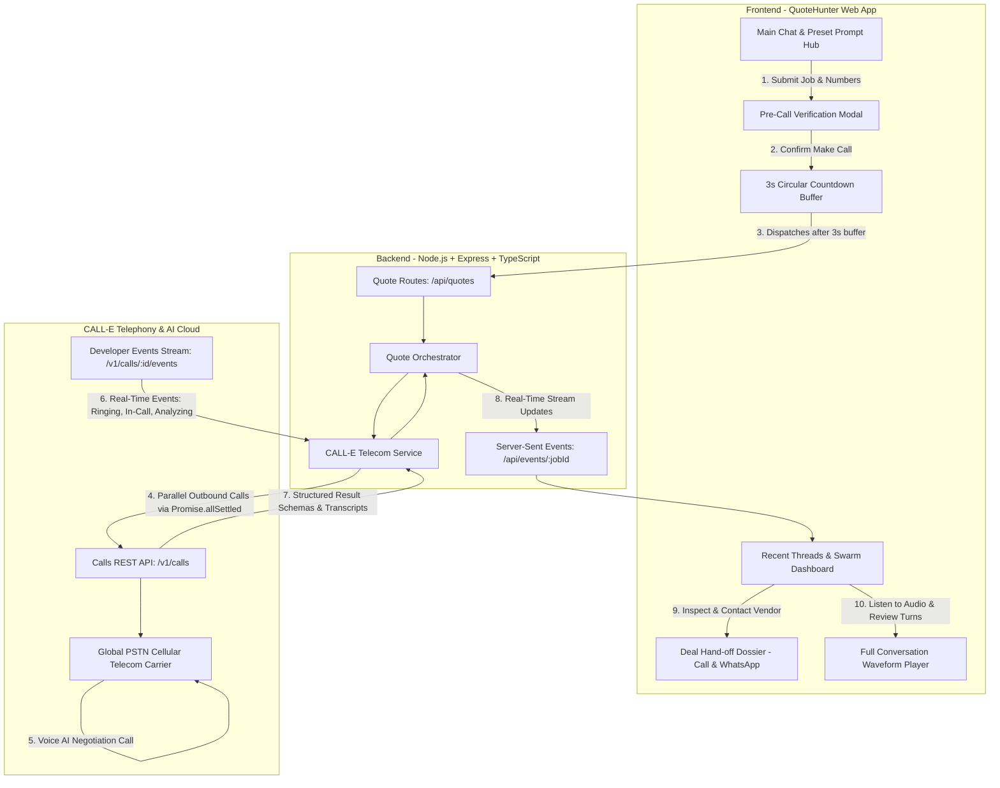

# 🏹 QuoteHunter — Autonomous AI Voice Negotiation Hub

> **Autonomous voice agent swarm that calls multiple local service providers in parallel via CALL-E, negotiates price quotes in real time, extracts structured spoken evidence, and provides an executive deal hand-off dossier for human closing.**

Built for the **CALL-E: Your Code Is Calling** Hackathon.

---

## 🌟 The Problem & Opportunity

When hiring local contractors or service providers (painters, plumbers, electricians, carpenters), **no public pricing API exists**. Homeowners and businesses typically spend 2–4 hours calling 5 to 10 local vendors, repeating the same job requirements, waiting through voicemail, and jotting down disorganized notes.

**Why Autonomous Phone Calling is the Solution:**
* **Ubiquitous Channel**: Phone calls are the universal standard for local trade commerce.
* **Dynamic Negotiation**: Real-world quotes require multi-turn conversational negotiation (*"Are materials included?", "Can you start earlier?", "Is that your best final price?"*).
* **Parallel Swarms**: Rather than calling vendors one-by-one over hours, QuoteHunter dispatches parallel CALL-E voice agents to negotiate with all vendors simultaneously in under 2 minutes.

---

## 🚀 Key Features & Capabilities

### 1. ⚡ True Concurrent Parallel Calling
* **Parallel Swarms (`Promise.allSettled`)**: Dials multiple vendors simultaneously with isolated idempotency keys (`qh_<jobId>_<vendorId>`) to prevent duplicate telecom dials.
* **Auto-Extraction & Custom Numbers**: Paste multiple phone numbers directly into the description prompt or add individual vendors via the E.164 formatted number modal.

### 2. 🛡️ Pre-Flight Verification & 3-Second Safety Buffer
* **Pre-Call Verification Modal**: Reviews prompt instructions and target numbers before triggering telecom carriers.
* **Circular SVG Countdown Ring ("Apple / Undo" Style)**: Features a 3-second animated circular countdown ring inside the bot status pill with an inline **`✕ Cancel`** button to abort before carrier network dispatch.

### 3. 📡 Granular Real-Time SSE Stream & Live Timer
* **Dual-Stream Lifecycle Tracking**: Live carrier status from `Provisioning` ➔ `Connecting Carrier` ➔ `Ringing 🔔` ➔ `In-Call 🎙️` ➔ `Extracting Quote 📊` ➔ `Quoted ✅`.
* **Dynamic Working Timer**: Real-time counter (`Working for 1s`, `2s`, `3s`...) updating per second during the hunt.

### 4. 🤝 Deal Hand-Off Dossier & Human Closing ("Contact & Book")
* **AI Negotiates, Human Closes**: Numbers remain masked during search and unmask upon clicking **"Contact & Book"**.
* **1-Click Quick Actions**:
  - 📞 **Direct Dial** (`tel:` link for 1-tap mobile/softphone calling).
  - 💬 **1-Click WhatsApp Direct**: Opens WhatsApp with a pre-filled negotiation confirmation message.
  - 📋 **Copy Deal Sheet**: Exports formatted negotiation summary (Price, Timeline, Terms, Audio Quote) to clipboard.

### 5. 🎙️ Full Conversation Player & Zero-Fabrication Guard
* Turn-by-turn speech waveform player with scrubber, audio playback, latency metrics, and verbatim evidence snippets.
* **Zero-Fabrication Guarantee**: Canceled, declined, or unanswered calls display an honest *"No Conversation Recorded"* state.

### 6. 🎨 Pure In-App UI / Zero System Popups
* 100% custom in-app floating toasts (`showToast`) and minimalist modal dialogs (`showCustomConfirm`). Zero browser `alert()`, `confirm()`, or `prompt()` popups.
* **Recents Thread History**: Persistent sidebar with inline renaming (`Enter` to save, `Escape` to cancel) and custom delete modal.

---

## 🏗️ System Architecture



---

## 🛡️ Production & Telephony Principles

| Principle | Implementation in QuoteHunter |
| :--- | :--- |
| **AI Identity Disclosure** | The AI agent introduces itself immediately on pickup: *"Hi, I am QuoteHunter AI calling on behalf of a customer regarding a [category] job."* |
| **Idempotency Protection** | Every outbound call is dispatched with a unique `Idempotency-Key` header (`qh_<jobId>_<vendorId>`) to prevent duplicate dials on network retries. |
| **Safety Pre-Flight Buffer** | 3-second animated circular SVG countdown ring allows users to stop the call before the carrier PSTN network is paged. |
| **Fail-Closed Dispositions** | Silence, busy tones, or unanswered calls are strictly classified as `No-Answer`, `Declined`, or `Canceled` without hallucinating quotes. |
| **Grounded Spoken Evidence** | Every price and timeline quote is anchored in a verbatim spoken transcript snippet with confidence validation. |
| **Human Authority Closing** | AI agents collect estimates and negotiate terms; final booking and financial authorization is executed by the human user via the **Contact & Book** Dossier. |

---

## 🛠️ Technology Stack

* **Backend**: Node.js, Express, TypeScript, Server-Sent Events (SSE).
* **AI Telephony**: CALL-E REST API (`/v1/calls`, `/v1/calls/:id/events`), JSON Schema extraction.
* **Frontend**: HTML5, Vanilla JavaScript (ES6+), Vanilla Tailwind CSS utilities, Google Material Symbols.
* **Audio & Speech Engine**: Web Speech Synthesis API, HTML5 Audio, phonetic text normalizer.
* **Storage**: LocalStorage thread persistence with full state restoration.

---

## 🚦 Quickstart & Local Setup

### Prerequisites
* **Node.js** v18+ (tested on v20+)
* **npm**

### Installation

```bash
# 1. Clone the repository
git clone https://github.com/GitSuman0699/CALL-E-Your-Code-Is-Calling.git
cd "CALL-E-Your-Code-Is-Calling"

# 2. Install dependencies
npm install

# 3. Configure environment variables
# Create a .env file in the root directory:
CALLE_API_KEY=your_calle_api_key_here
PORT=3000

# 4. Start development server
npm run dev
```

Open **`http://localhost:3000`** in your browser.

---

## 📱 Complete User Workflow

```
[ 1. Select Preset or Type Prompt ] 
                │
                ▼
[ 2. Add Phone Number(s) with Country Code ] 
                │
                ▼
[ 3. Click Make Call ➔ Review "Check Call Details" Popup ]
                │
                ▼
[ 4. 3-Second Animated Countdown Ring (Instant Cancel Window) ]
                │
                ▼
[ 5. Live Swarm Thread: Real-Time Dialing, Ringing & In-Call Status ]
                │
                ▼
[ 6. Automatic Best Quote Calculation & Side-by-Side Comparison ]
                │
                ▼
[ 7. Click "Contact & Book" ➔ Reveal Unmasked Number, 1-Click Call / WhatsApp ]
                │
                ▼
[ 8. Click "View Full Conversation" ➔ Turn-by-Turn Spoken Waveform Player ]
```

---

## 📄 License

MIT License. Built for the **CALL-E: Your Code Is Calling** Hackathon.
